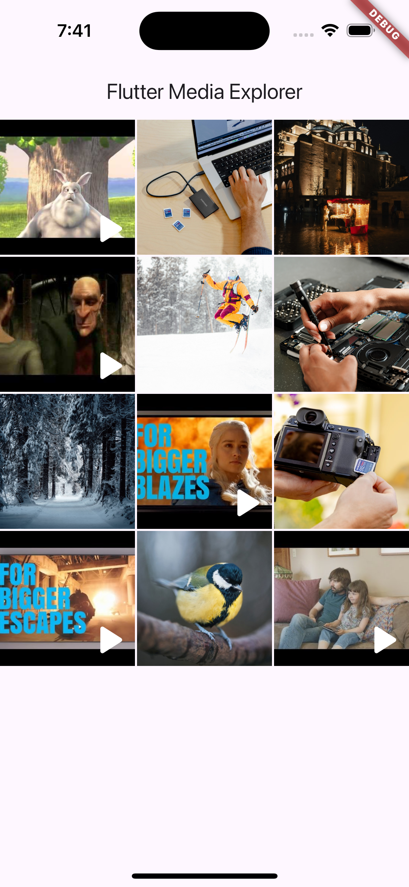
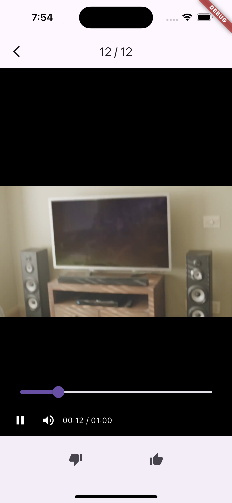

# Media Explorer App - Flutter
🎉 Welcome to the **Media Explorer App** - a project designed to inspire and help you build your very own interactive media gallery in Flutter!

The goal of this project is to turn **Media Explorer** into a plug-and-play package, however, I am not there yet. Instead, I'm sharing this project to all Flutter developers in hopes to fine tune it's UI before it becomes an intallable package. **Media Explorer** is being built to create the smoothest, most delightful content experience in Flutter. With animations that bring your media to life - from fluid GridViews to immersive PageViews! 

Whether you're building a portfolio app, a content-heavy social media app, or just experimenting with media in Flutter, this project has everything you need to make your media shine. Ready to explore? Let's dive in! 🚀

## 📸 Screenshots 

||||

## 


## 📦 Packages and Versions
* [http](https://pub.dev/packages/http) 1.2.2
* [overscroll_pop](https://pub.dev/packages/overscroll_pop) 0.1.1
* [provider](https://pub.dev/packages/provider) 6.1.2
* [video_player](https://pub.dev/packages/video_player) 2.9.2

## ✨ Features
- **Dynamic GridView:** Display images and videos side by side, elegantly organized.
- **Interactive PageView:** Swipe through media effortlessly with beautiful transitions. This project simulates cloud stored content.
- **Advanced Video Playback Controls:** Play, pause, adjust volume, and even seek through videos with ease.
- **Tap-to-Hide Controls:** Focus on the media by toggling UI elements with a single tap.
- **Smooth Animations:** Experience battery-smooth transitions that make navigation a joy.
- **Provider-Powered State Management:** Built with a simple state management solution.
- Does not currently support web yet...

## 📕 Getting Started

Ready to dive in? To continue making this media explorer even better, follow these simple steps:

1. Clone the repository:
```bash
git clone https://github.com/[username]/flutter_media_explorer.git
```
2. Install Dependencies
```bash
flutter pub get
```
3. Run the App
```bash
flutter run
```

### 💡 Test Data
This project comes with specially curated test data to get you started right away!
- You'll find the test data and widget tests in the `test/` folder
- The videos are courtesy of https://github.com/jsturgis
- Look out for he `test_data.json` file - the backbone to trying out the entirety of the application

## 📂 Project Structure
- `lib/models`: Home to the the `Media` and `MediaType` models.
- `lib/pages`: Contains the main pages of the app.
- `lib/providers`: State management made easy with Provider
- `lib/widgets`: Reusable widgets for building a polished UI

## 🤝 Contributing
Great things are never built alone! You and I can build this together, and your contributions are what make this project 🔥 Here's how you can help:

* Found a Bug? 🐞
  * Opan an issue and let me know - no bug is too small!
* Have a Feature Idea? 💡
  * Share your vision by creating a new issue or messaging me :)
* Ready to Contribute?
  * Fork the repository
  * Create a new branch for your feature or fix:
    * `git checkout -b feature/awesome-feature`
  * Make your changes, commit, and push:
    * `git commit -m "Add awesome feature!"`
    * `git push origin feature/awesome-feature`
  * Open a pull request - I'd love to see what you've built and how it makes **Media Explorer** better!